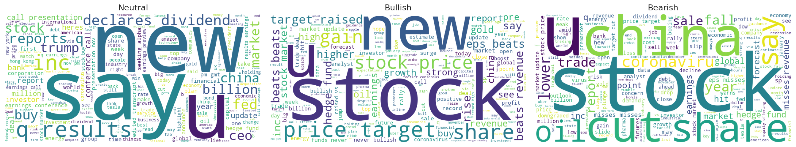
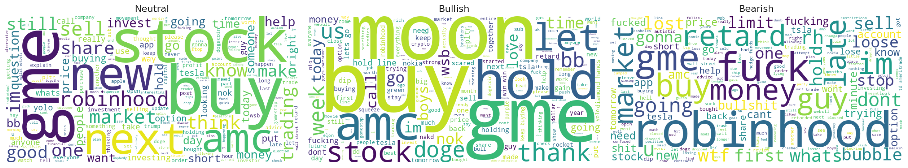
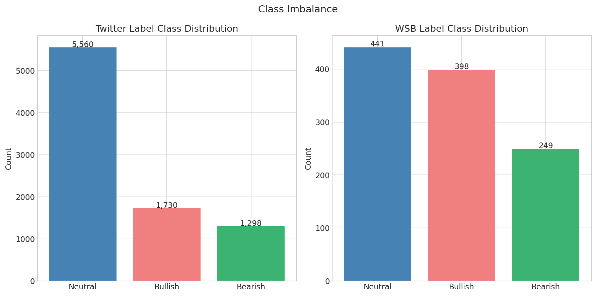
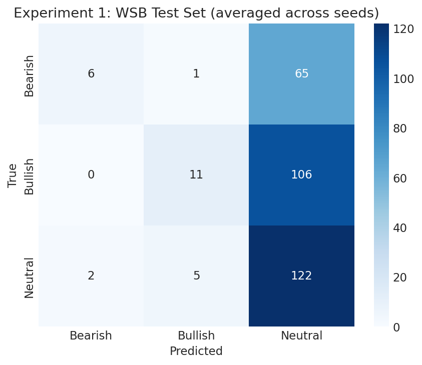
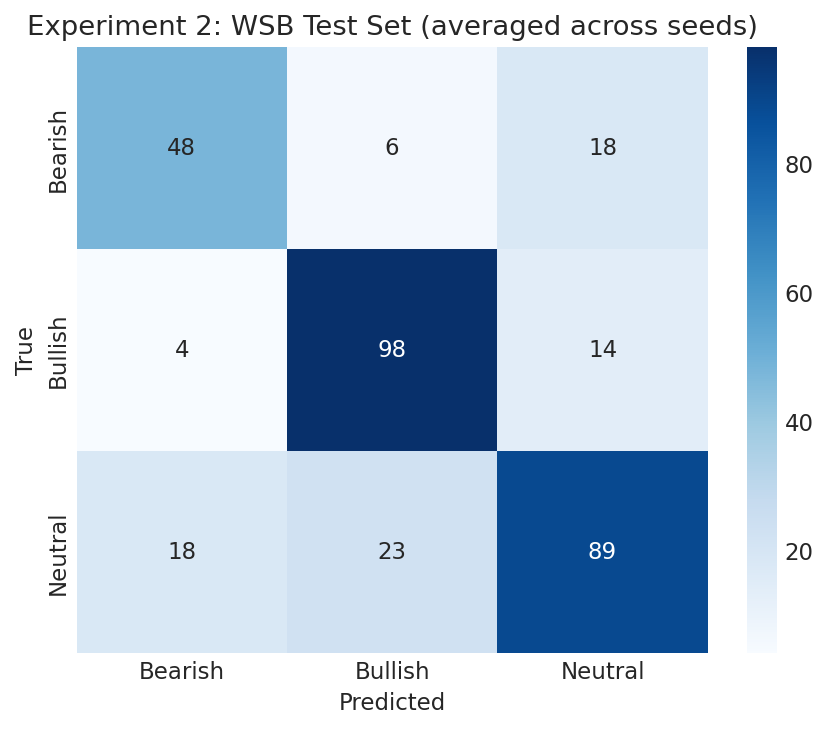
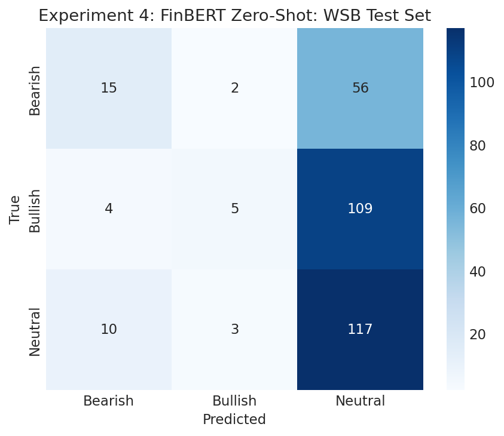

# Financial Sentiment Analysis: Domain Transfer Across Social Media Registers

This project investigates the transferability of financial sentiment models across linguistic domains, from curated financial Twitter data to the informal, meme-driven language of Reddit's WallStreetBets (WSB) community. The central question is whether models trained on structured financial social media text can generalize to the radically different register of retail investor discourse, and whether financial domain pretraining provides an advantage over general pretraining when adapting to social media financial text.

---

## Questions

1. How severe is the domain gap between formal financial Twitter and informal WSB discourse, and can it be quantified?
2. Does fine-tuning on a small amount of in-domain WSB data recover performance lost to the domain gap?
3. Does WSB adaptation hurt generalization to formal financial text (Financial PhraseBank)?
4. Does financial domain pretraining (FinBERT) outperform general pretraining (DistilBERT) in zero-shot and fine-tuned settings on social media financial text?

---

## Project Structure

```
├── NLP_sentiment_analysis.ipynb               # Main experimental notebook
└──Report/
    └── figures/                               # All visualizations
```

---

## Datasets

| Dataset | Source | Size | Label Schema | Role |
|---------|--------|------|-------------|------|
| Twitter Financial News Sentiment | `zeroshot/twitter-financial-news-sentiment` | 11,931 | Bullish / Bearish / Neutral | Primary training data |
| WallStreetBets | `zchengc/wsb` | 1,602 | Bullish / Bearish / Neutral | Domain adaptation + evaluation |
| Financial PhraseBank | `warwickai/financial_phrasebank_mirror` | 4,846 | Positive / Negative / Neutral | Held-out generalization test |

All datasets use a unified canonical label schema: **Bearish=0, Bullish=1, Neutral=2**.

---

## Models

- **DistilBERT** (`distilbert-base-uncased`): lightweight general-purpose transformer, domain-agnostic baseline
- **FinBERT** (`ProsusAI/finbert`): BERT pretrained on financial corpora and fine-tuned on Financial PhraseBank, finance-specialized baseline

---

## Experimental Design

Five experiments are conducted in sequence, progressively building toward the core research question. All training experiments use three random seeds (26, 42, 74) with results reported as mean ± standard deviation. Balanced class weights are applied during training to handle class imbalance. **Macro F1 is the primary evaluation metric.**

| Experiment | Model | Train Data | Eval Set | Purpose |
|------------|-------|------------|----------|---------|
| 1 | DistilBERT | Twitter | Twitter + WSB | Establish domain gap baseline |
| 2 | DistilBERT | Twitter + WSB | Twitter + WSB | Measure domain adaptation effect |
| 3 | DistilBERT | Twitter / Twitter+WSB | PhraseBank | Measure formality generalization |
| 4 | FinBERT | None (zero-shot) | Twitter + WSB | Finance-pretrained baseline |
| 5 | FinBERT | Twitter + WSB | Twitter + WSB | Pretraining vs fine-tuning question |

---

## EDA Highlights

The word clouds and frequency analysis reveal a stark domain gap between the two training datasets.

**Twitter Financial News** uses structured, professional vocabulary: sentiment is expressed through factual framing ("beats", "target", "misses", "cut").

**WallStreetBets** operates in a fundamentally different register: Bullish sentiment manifests as meme language ("moon", "gme", "diamond hands"), while Bearish sentiment is driven by frustration and profanity rather than analytical language.




The class distributions differ significantly between datasets. Twitter is heavily skewed toward Neutral (65%), while WSB is considerably more balanced (40% Neutral, 37% Bullish, 23% Bearish).



---

## Results

### Full Results Table

| Experiment | Model | Train Data | Eval Set | Macro F1 | Weighted F1 | Accuracy |
|------------|-------|------------|----------|----------|-------------|----------|
| 1 | DistilBERT | Twitter | Twitter Test | 0.8361 ± 0.0030 | 0.8729 ± 0.0027 | 0.8710 ± 0.0029 |
| 1 | DistilBERT | Twitter | WSB Test | 0.2972 ± 0.0092 | 0.3278 ± 0.0074 | 0.4351 ± 0.0029 |
| 2 | DistilBERT | Twitter + WSB | Twitter Test | 0.8287 ± 0.0046 | 0.8652 ± 0.0033 | 0.8621 ± 0.0037 |
| 2 | DistilBERT | Twitter + WSB | WSB Test | 0.7249 ± 0.0192 | 0.7322 ± 0.0191 | 0.7342 ± 0.0184 |
| 3 | DistilBERT | Twitter | PhraseBank | 0.6918 ± 0.0058 | 0.7290 ± 0.0042 | 0.7480 ± 0.0055 |
| 3 | DistilBERT | Twitter + WSB | PhraseBank | 0.6979 ± 0.0034 | 0.7314 ± 0.0031 | 0.7421 ± 0.0054 |
| 4 | FinBERT | None (zero-shot) | Twitter Test | 0.6682 | 0.7329 | 0.7253 |
| 4 | FinBERT | None (zero-shot) | WSB Test | 0.3134 | 0.3256 | 0.4268 |
| 5 | FinBERT | Twitter + WSB | Twitter Test | 0.8292 ± 0.0013 | 0.8685 ± 0.0012 | 0.8663 ± 0.0012 |
| 5 | FinBERT | Twitter + WSB | WSB Test | 0.7338 ± 0.0135 | 0.7415 ± 0.0122 | 0.7425 ± 0.0115 |

---

## Key Findings

### Finding 1: The domain gap between formal financial Twitter and informal WSB is severe

DistilBERT trained exclusively on Twitter collapses almost entirely to predicting Neutral on WSB data, achieving a macro F1 of 0.297: barely above random chance (0.333). The confusion matrix below shows the failure mode clearly: the model predicts Neutral for virtually all WSB examples, correctly identifying only 6 Bearish and 11 Bullish posts out of 72 and 117 respectively.



### Finding 2: A small amount of in-domain data dramatically bridges the domain gap

Adding just 1,088 WSB training examples to the Twitter training set improves DistilBERT's WSB macro F1 from 0.297 to 0.725: a **144% relative improvement**. Critically, Twitter performance degrades only marginally (0.836 → 0.829), demonstrating successful domain adaptation without catastrophic forgetting.



### Finding 3: WSB fine-tuning does not hurt generalization to formal financial text

DistilBERT fine-tuned on Twitter + WSB achieves a PhraseBank macro F1 of 0.698, compared to 0.692 for the Twitter-only model: a negligible difference. Adding informal WSB training data neither helps nor hurts performance on formal analyst sentences, suggesting the two domains occupy sufficiently distinct linguistic spaces that learning one does not interfere with the other.

### Finding 4: Financial domain pretraining does not outperform general pretraining when fine-tuning data is available

When fine-tuned on identical Twitter + WSB training data, FinBERT and DistilBERT achieve essentially equivalent performance: 0.829 vs 0.829 on Twitter and 0.734 vs 0.725 on WSB. The differences fall within normal training variance. Labeled fine-tuning data is the dominant factor in determining performance.

### Finding 5: Financial domain pretraining improves training stability

Despite similar final performance, FinBERT exhibits substantially lower variance across seeds compared to DistilBERT: std=0.0013 vs 0.0046 on Twitter and std=0.0135 vs 0.0192 on WSB. Financial domain pretraining produces a more stable optimization landscape, which has practical implications for production deployments where reproducibility is valued.

### Finding 6: Zero-shot financial domain knowledge does not transfer to social media

FinBERT zero-shot achieves 0.668 macro F1 on Twitter Financial News but only 0.313 on WSB: exhibiting the same Neutral-collapse failure mode as DistilBERT. The linguistic register gap between formal financial text and retail investor social media is too large for pretraining alone to bridge.



---

## Limitations

- The WSB dataset contains only 1,602 examples concentrated around the January 2021 GameStop short squeeze, results may not generalize to other time periods or market conditions.
- Label noise in the WSB dataset is non-trivial, as Bearish sentiment often manifests as expressions of personal loss rather than analytical judgment.
- All experiments use fixed hyperparameters optimized for DistilBERT, a dedicated hyperparameter search for FinBERT may yield improved results.
- Macro F1 treats all classes equally, which may not reflect real-world deployment priorities where Bearish sentiment detection carries higher practical value.

---

## Setup & Reproducibility

### Requirements

```bash
pip install transformers datasets torch scikit-learn
pip install seaborn matplotlib wordcloud emoji nltk
```

### Reproducing Results

All experiments are contained in `NLP_sentiment_analysis.ipynb`. Run cells sequentially. Random seeds are fixed at [26, 42, 74] for all training experiments. Data splits use a fixed seed of 42.

### Hardware

Experiments were run on an NVIDIA GTX 1650 (4GB VRAM) with fp16 mixed precision training enabled. Expected training time: ~45-75 minutes per experiment (3 seeds × 3 epochs).

---

## Technical Details

- **Tokenizer**: `distilbert-base-uncased` WordPiece, MAX_LEN=100 (covers 100% of both datasets)
- **Training**: HuggingFace Trainer API with weighted cross-entropy loss (balanced class weights)
- **Evaluation metric**: Macro F1 (primary), Weighted F1 + Accuracy (secondary)
- **Batch size**: 16
- **Learning rate**: 2e-5
- **Epochs**: 3
- **Warmup ratio**: 0.1
- **Weight decay**: 0.01

---

## Stack

`Python` · `PyTorch` · `HuggingFace Transformers` · `HuggingFace Datasets` · `scikit-learn` · `MLflow` · `AWS` · `seaborn` · `matplotlib`

---

Built by Rishabh Bubna : [LinkedIn](https://www.linkedin.com/in/dr-rishabh-bubna-304bb3172/)
